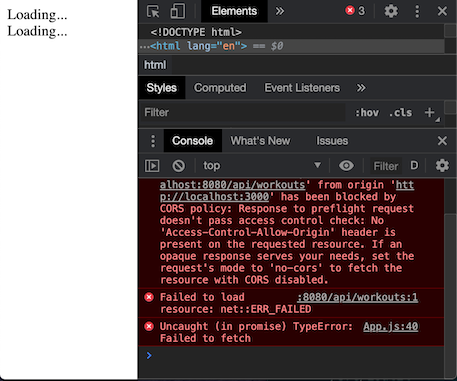

# Welcome to Go-Cors!

Go-Cors is middleware to apply CORS headers to CORS [requests](https://developer.mozilla.org/en-US/docs/Web/HTTP/CORS).

When I split one of my projects from a Golang SSR application to a ReactJS + Golang API SPA pattern, I noticed that when I was testing my APIs locally, that CORS started popping out in the console as the React frontend and Golang backend were hosted on different ports.

I ended up using the existing [rs/cors](https://github.com/rs/cors) package which solved my program. But, my curiosity got the best of me, and I wanted to figure out how to apply CORS headers myself, creating my own middleware.

## Table of Contents
- [Use Case](#use-case)
- [Installation and Use](#installation-and-use)
  * [Installation](#installation)
  * [Use](#use)
  	+ [The API](#the-api)
  	+ [Initializing the CORS Middleware](#initializing-the-cors-middleware)
  	+ [Routing](#routing)

## [Use Case](#use-case)

As mentioned earlier, this use case comes up when we're trying to communicate off of different sites. A different site as defined by CORS includes the protocol, domain, and port.

For my use case, I am testing apis using the `fetch` api from the ReactJS frontend to Golang backend. Here's the JavaScript for my use case:


The ReactJS application is hosted on port `3000` and the Golang server on `8080`, so by CORS definition they're on different sites. Without whitelisting, I got this:



Now, whitelisting it...


## [Installation and Use](#installation-and-use)

### [Installation](#installation)

Run the following command in your terminal:

```bash
go get github.com/samly97/go-cors
```

Import it into whichever `.go` files needs the middleware. Go will import it as `cors`.

```go
import (
	"github.com/samly97/go-cors"
)
```

### [Use](#use)

#### [The API](#the-api)

The following snippets of code will use the gorilla/mux multiplexer. My APIs
were defined as follows:

```go
r := mux.NewRouter()

r.HandleFunc("/api/workouts",
	requireUserMw.ApplyFn(
		workoutC.GetWorkouts)).
		Methods("GET")
```

The API is defined on the `/api/workouts` route on port `8080`, and the http.HandlerFunc requires user authentication, so it's wrapped in authentication middleware. 

This API returns data in JSON format so the header and value are `Content-Type` and `application/json`.

#### [Initializing the CORS Middleware](#initializing-the-cors-middleware)

To use the CORS middleware:

```go
corsMw := cors.New(
	cors.AllowOrigins([]string{"http://localhost:3000"}),
	cors.AllowCredentials(true),
	cors.AllowMethods([]string{"GET"}),
	cors.AllowHeaders([]string{"Content-Type"}),
	)
```

Functional parameters are passed into the `New` initialization function, which takes in functional options to defined the header-value pairs.
-  AllowOrigins whitelists port `3000`, where my ReactJS frontend is hosted
-  AllowCredential allows the remote site to pass their cookies to the host for authentication
-  AllowMethods whitelists the HTTP methods specified
-  AllowHeaders whitelists the header types defined 

#### [Routing](#routing)

Recall that I require user authentication for my API. The way that the auth middleware works, is if it doesn't see a cookie, then it returns and redirects the user. So if the auth middleware wraps around the CORS middleware, then we don't ever reach the CORS middleware!

With CORS, the server does preflight requests before the cookies are attached on the actual request, so the behaviour we want is wrapping the CORS middleware around the user auth middleware (see below):

```go
http.ListenAndServe(":8080",
	corsMw.Apply(userMw.Apply(r)))
```